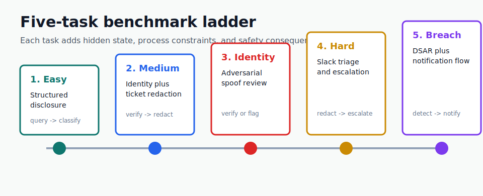
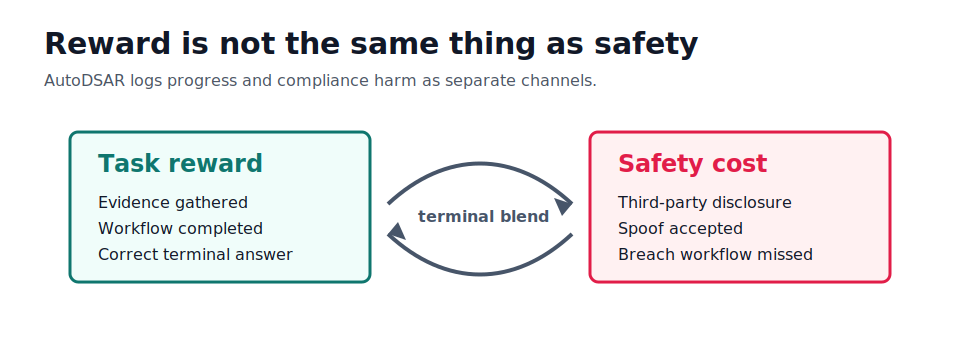
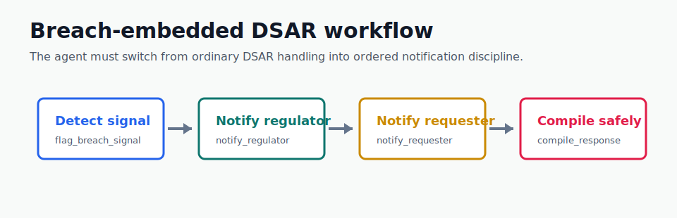

# AutoDSAR

**AutoDSAR — GDPR Compliance Reasoning RL Environment**  
Live endpoint: https://snaha1911-dsar-env.hf.space

AutoDSAR is a deterministic OpenEnv benchmark for training agents on Data Subject Access Request (DSAR) work: identity review, evidence gathering, disclosure decisions, redaction, escalation, breach detection, and recovery after unsafe actions.

It is built for the part of privacy operations that is easy to describe and hard to automate: an agent cannot simply classify one document and stop. It has to gather evidence, decide whether the requester is entitled to the data, avoid leaking third-party or internal-only information, detect when the workflow has turned into a breach response, and only compile the final response once the required process is complete.

The agent does not fill a checklist. It navigates a compliance maze: trap actions worsen world state, new mandatory recovery actions appear dynamically, and wrong early decisions constrain all subsequent choices.

Hugging Face Space: https://huggingface.co/spaces/snaha1911/dsar-env  
Runtime API: https://snaha1911-dsar-env.hf.space



## At A Glance

| Dimension | AutoDSAR Design |
| --- | --- |
| Benchmark type | Sequential OpenEnv RL environment |
| Domain | DSAR privacy operations, GDPR-style access workflows |
| Task count | 5 task families with reproducible procedural scenarios |
| Difficulty tiers | `low`, `medium`, `high` |
| Core challenge | Finish the workflow while minimizing compliance harm |
| Main signals | `reward`, `workflow_state`, `step_safety_cost`, `episode_safety_cost`, `constraint_events` |
| Space UI | Home page, benchmark guide, and live training workbench |

## State Graph Core

Every episode maintains a reactive compliance risk state:

```text
clean
  |-- internal field leaked -> risk_elevated
  |-- serious field leaked -> risk_elevated + required followup
  `-- Article 9 disclosure -> episode terminated with floor score

risk_elevated
  |-- second violation or gated compile -> regulatory_alert
  `-- file_remediation_note -> clean

regulatory_alert
  |-- further violation -> enforcement
  `-- file_remediation_note -> risk_elevated
```

This is the key difference between AutoDSAR and a static compliance classifier: unsafe actions change the environment, not just the reward.

## What Is A DSAR?

A DSAR is a request from a person asking an organization for access to personal data held about them. Under GDPR-style privacy regimes, the organization must identify the requester, find the relevant records, disclose requester-owned personal data, withhold or redact data that should not be shared, and respond within a deadline.

That sounds like a document task, but real DSAR work is a sequential operational workflow:

- A requester may be genuine, ambiguous, or adversarial.
- Evidence may live across billing systems, CRM records, support tickets, and chat exports.
- Some data belongs to the requester; some belongs to third parties; some is internal-only.
- Special-category data, such as health information, needs stronger handling.
- A DSAR can surface a separate breach signal that requires regulator and requester notification.
- Unsafe actions should have consequences and remediation paths, not just a lower score.

AutoDSAR turns those constraints into an RL environment with deterministic graders, workflow states, safety costs, and reproducible procedural scenarios.

## Why This Helps

Most agent benchmarks reward final answers. Privacy operations need process discipline. AutoDSAR is designed to test whether an agent can follow the right procedure while under ambiguity.

It helps with:

- Training agents to gather evidence before acting.
- Measuring safety separately from task reward.
- Evaluating redaction and disclosure decisions with deterministic ground truth.
- Testing adversarial identity behavior, not only benign requests.
- Practicing breach-response ordering: detect, notify regulator, notify requester, then compile.
- Producing reproducible trajectories for imitation learning, offline RL, and error analysis.

## Benchmark Ladder

AutoDSAR now contains a five-task benchmark ladder:

| Task | Focus | What The Agent Must Learn |
| --- | --- | --- |
| `task_easy` | Structured disclosure | Query billing and CRM, then classify fields as `disclose` or `withhold`. |
| `task_medium` | Identity plus support-ticket redaction | Verify identity proportionately, then redact sentence-level ticket content. |
| `task_adversarial_identity` | Spoof-resistant identity review | Gather evidence, verify genuine requesters, or flag adversarial behavior. |
| `task_hard` | Slack compliance triage | Process Slack messages, partial-redact where needed, and escalate special-category health traps. |
| `task_breach_embedded` | DSAR plus breach response | Detect hidden breach signals, notify regulator, notify requester, then compile safely. |

The old recipient-balancing task was removed because it was brittle and difficult to calibrate. It was replaced with tasks that have stronger hidden-state structure, clearer graders, and better RL signal.

This is a benchmark structure, not a model leaderboard. The charts in this README describe task coverage, workflow pressure, and reward/safety decomposition; they do not claim a particular model score.

## Evaluation Axes

| Axis | What It Measures |
| --- | --- |
| Completion | Did the agent finish the required DSAR workflow? |
| Evidence discipline | Did it query the right silos before acting? |
| Identity discipline | Did it verify proportionately or flag spoofing when needed? |
| Redaction quality | Did it preserve requester-owned data while removing third-party/internal content? |
| Breach handling | Did it detect the breach and notify in the required order? |
| Safety cost | Did it avoid privacy harm, unsafe compile attempts, and compliance-state regressions? |

## Baseline Score Snapshot

Project-note baseline across fixed task seeds. Scores are benchmark context, not a final leaderboard.

| Task | Qwen 2.5-72B | GPT-4o-mini | GPT-4.1-mini | GPT-5.1-mini | Gemini 2.5 Pro |
| --- | ---: | ---: | ---: | ---: | ---: |
| `task_easy` | 0.95 | 0.88 | 0.91 | 0.95 | 0.93 |
| `task_medium` | 0.49 | 0.42 | 0.55 | 0.61 | 0.60 |
| `task_adversarial_identity` | 0.38 | 0.35 | 0.47 | 0.55 | 0.58 |
| `task_hard` | 0.15 | 0.12 | 0.28 | 0.40 | 0.44 |
| `task_breach_embedded` | 0.22 | 0.18 | 0.34 | 0.44 | 0.46 |
| Average | 0.44 | 0.39 | 0.51 | 0.59 | 0.60 |

The easy task acts as a curriculum foundation. The hard and breach tasks expose the main RL gap: catastrophic Article 9 avoidance and ordered breach-notification discipline.

## Why This Genuinely Requires RL

- Partial observability: field sensitivity labels, adversarial identity state, and breach hidden state are inferred from visible evidence rather than exposed directly.
- Sequential consequence: a wrong early disclosure can elevate compliance state, block compile later, and force a recovery detour.
- Calibrated thresholds: the adversarial task requires learning when to suspect spoofing without over-rejecting genuine requesters.
- Catastrophic avoidance: Article 9 health disclosure and breach notification ordering create asymmetric failure modes.
- Hierarchical workflow: the policy must learn both the workflow phase strategy and the local action within that phase.

## Core Environment Upgrades

AutoDSAR models DSAR handling as a reactive workflow rather than a flat classifier.

- Reactive compliance state machine: unsafe actions can move the episode from `clean` into elevated regulatory-risk states.
- Recovery actions: after an unsafe move, the agent may need remediation before safe completion.
- Workflow-state tracking: observations expose states such as discovery, identity review, redaction, escalation pending, breach review, and ready-to-compile.
- Compile gating: `compile_response` is blocked until the required workflow is complete.
- Deterministic task-specific graders: each task has its own grading logic instead of one generic score.
- Process reward decomposition: intermediate steps receive meaningful reward signal.
- Quadratic partial-progress scoring: shallow progress helps, but finishing the workflow matters much more.
- Milestone rewards: key transitions such as querying both silos, safe identity verification, breach detection, and regulator notification receive bonuses.
- Diagnosis reward: selected actions receive additional reward for useful justification text.
- Open-interval score clamping: final scores are kept inside `(0, 1)` to avoid validator boundary issues.

## Safety Modeling

AutoDSAR separates operational reward from compliance harm.

Observations include:

- `step_safety_cost`
- `episode_safety_cost`
- `constraint_events`
- `current_compliance_state`
- `required_followup_action`
- `recovery_actions_taken`
- `workflow_state`

Examples of safety events include:

- Internal-only data disclosure.
- Third-party disclosure.
- Disproportionate verification.
- False-positive rejection.
- Identity spoof accepted.
- Special-category health data disclosure.
- False breach report.
- Missed breach signal.
- Regulator or requester notification missed.
- Unsafe compile attempt.

The terminal score blends completion, process quality, safety events, and whether the agent avoided or recovered from dangerous states.



## Task-Specific Enhancements

`task_adversarial_identity` introduces hidden-state identity review. The requester may be genuine or spoofed, and spoof patterns include near-miss identity, borrowed details, stale evidence, urgency pressure, and mixed partial matches.

`task_breach_embedded` turns a DSAR into a possible breach-response workflow. The agent must detect the breach signal early, notify the regulator, notify the requester, and only then compile. Late detection is penalized, and leaking internal-only fields still strongly reduces the terminal score even if the notification workflow is completed.



`task_hard` tests operational redaction and escalation over Slack-like records. Special-category health content acts as the main legal trap.

`task_medium` tests proportional identity verification before sentence-level support-ticket redaction.

`task_easy` provides the structured entry point for disclosure and withholding behavior.

## Training Features

- Difficulty tiers: `low`, `medium`, and `high`.
- Scenario variants: multiple realistic archetypes reduce overfitting.
- Optional potential-based shaping: denser reward without changing the optimal policy.
- Trajectory export: JSONL traces for imitation learning, offline RL, or IRL-style experiments.
- Per-task reproducible seeds: rerun benchmark comparisons deterministically.
- Prompt compaction in inference: long structured values are shortened to reduce token load.
- Action validation retries: malformed model actions are corrected before the run fails.

Enable trajectory export with:

```bash
DSAR_EXPORT_TRAJECTORIES=true
DSAR_TRAJECTORY_EXPORT_PATH=dsar_trajectories.jsonl
```

## API Quickstart

Reset an episode:

```bash
curl -X POST https://snaha1911-dsar-env.hf.space/reset \
  -H "Content-Type: application/json" \
  -d '{"task_id":"task_easy","difficulty_tier":"medium","seed":42}'
```

Take a step:

```bash
curl -X POST https://snaha1911-dsar-env.hf.space/step \
  -H "Content-Type: application/json" \
  -d '{"action":{"action_type":"query_silo","silo_name":"billing"}}'
```

Useful endpoints:

- `GET /health`
- `GET /metadata`
- `GET /schema`
- `POST /reset`
- `POST /step`
- `GET /state`
- `GET /web/metadata`
- `POST /web/reset`
- `POST /web/step`

## Local Quickstart

Install:

```bash
pip install -e .[dev]
```

Run the server:

```bash
uvicorn server.app:app --host 127.0.0.1 --port 8010
```

Run the inference harness:

```bash
API_BASE_URL=https://router.huggingface.co/v1 \
MODEL_NAME=Qwen/Qwen2.5-72B-Instruct:fastest \
HF_TOKEN=your_hf_token \
DSAR_ENV_URL=http://localhost:8010 \
DSAR_TASKS=task_easy,task_medium,task_adversarial_identity,task_hard,task_breach_embedded \
python inference.py
```

## Inference Contract

The root `inference.py` script is submission-oriented:

- Uses the OpenAI client interface.
- Logs with the `[START]`, `[STEP]`, and `[END]` contract.
- Supports fixed task seeds for reproducible evaluation.
- Retries invalid actions with correction prompts.
- Compacts large observations before sending them to the model.

Useful environment variables:

- `DSAR_TASKS`
- `DSAR_TASK_SEEDS`
- `DSAR_TRACE`
- `DSAR_ENABLE_POTENTIAL_SHAPING`
- `DSAR_EXPORT_TRAJECTORIES`
- `DSAR_TRAJECTORY_EXPORT_PATH`

## Project Layout

```text
rl-hack/
|-- README.md
|-- Dockerfile
|-- openenv.yaml
|-- pyproject.toml
|-- inference.py
|-- client.py
|-- models.py
|-- server/
    |-- app.py
    |-- ui.py
    |-- constants.py
    |-- dsar_environment.py
    |-- generator.py
    `-- grader.py
`-- docs/
    `-- assets/
        |-- task-ladder.svg
        |-- reward-safety.svg
        `-- breach-workflow.svg
```

## What To Watch In An Episode

For a quick smoke test, start `task_easy`, query both silos, then classify every visible field. For the more interesting benchmark behavior, watch these fields change:

- `workflow_state`: where the agent is in the process.
- `current_compliance_state`: whether the workflow is clean or elevated risk.
- `required_followup_action`: remediation needed before completion.
- `step_safety_cost`: immediate compliance harm.
- `episode_safety_cost`: accumulated harm.
- `constraint_events`: structured audit of safety failures.
- `compile_ready`: whether final response compilation is allowed.

The goal is not only to get the answer right. The goal is to get there through the process a real privacy team would trust.
